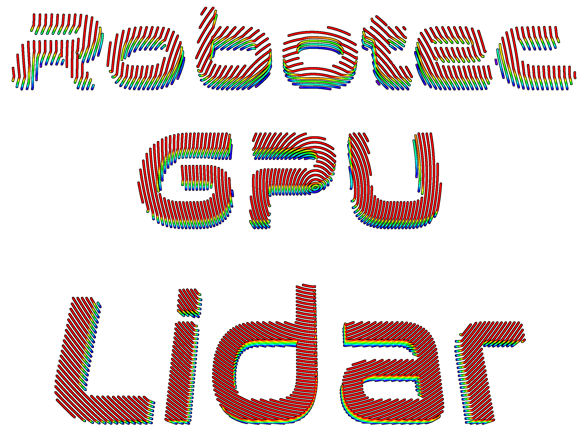

# Robotec GPU Lidar

<h1 align="center">
  
</h1>

## About the project

Robotec GPU Lidar (RGL) is a cross-platform (Windows and Linux), C/C++ library developed by [Robotec.AI](https://robotec.ai/)
for simulating [LiDARs](https://en.wikipedia.org/wiki/Lidar) on CUDA-enabled GPUs, accelerated by RTX cores if available.

One of the use-cases of RGL is implementing Lidar sensors in simulation engines.
We are working on integrations with popular game / simulation engines:
- [Unity](https://unity.com/)
- [O3DE](https://www.o3de.org/)
- [Gazebo](https://gazebosim.org/home)

If you would like to have a custom integration, feel free to [contact us](https://robotec.ai/contact/).

## Features

|   |   |
|---|---|
| **Configurable LiDAR pattern and range** | **High performance** |
|  |  |
| **GPU-accelerated pointcloud processing** | **Flexible pipeline creation** |
|  |  |

And more:
- Asynchronous raytracing
- Removing non-hit points
- Converting to custom binary output
- Downsampling
- Writing to PCD file

## Runtime requirements

|Hardware|Requirement|
|:--|:--|
|GPU|CUDA-enabled|

|Software|Requirement|
|:--|:--|
|Nvidia Driver (Linux)|>=460.27.03|
|Nvidia Driver (Windows)|>=472.50|

## Usage

An introduction to the RGL API along with an example can be found [here](docs/Usage.md).

## Extensions

`RobotecGPULidar` library can be built with extensions that add nodes with different functionalities:
- `ROS2` - enables publishing point cloud messages to [ROS2](https://www.ros.org/).

## Building in Docker (Linux)

Two dockerfiles are prepared:
- `DockerfileMinimal` - image designed to meet RGL minimal requirements
- `DockerfileLatest` - image with latest Ubuntu and CUDA Toolkit version

Build instructions:
1. Set up [NVIDIA Container Toolkit](https://docs.nvidia.com/datacenter/cloud-native/container-toolkit/install-guide.html#docker)
2. Download [NVidia OptiX](https://developer.nvidia.com/designworks/optix/downloads/legacy) **7.2**
3. `export OptiX_INSTALL_DIR=<Path to OptiX>`
4. `docker build . -f DockerfileMinimal --tag rgl:minimal`
5. `docker run --net=host --gpus all -v $(pwd):/code -v ${OptiX_INSTALL_DIR}:/optix -e OptiX_INSTALL_DIR=/optix -e NVIDIA_DRIVER_CAPABILITIES=all -it rgl:minimal /bin/bash`
6. `./setup.bash --make -j`

## Building on Ubuntu

1. Install [CUDA Toolkit](https://developer.nvidia.com/cuda-downloads) **11.2+**.
2. Download [NVidia OptiX](https://developer.nvidia.com/designworks/optix/downloads/legacy) **7.2**.
    1. You may be asked to create Nvidia account to download
3. Export environment variable:
   1. `export OptiX_INSTALL_DIR=<your-OptiX-path>`.
4. Use `setup.bash --rgl-install-deps` script to install RGL dependencies.
   - It will install dependencies from `apt` and [vcpkg](https://vcpkg.io/en/index.html).
5. Use `setup.bash` script to build.
   - It will run CMake and then make.
   - You can pass optional CMake and make parameters, e.g.
     - `./setup.bash --cmake -DCMAKE_BUILD_TYPE=Debug --make -j 16`
   - See `setup.bash --help` for usage information.

## Building on Windows

1. Install [CUDA Toolkit](https://developer.nvidia.com/cuda-downloads) **11.4.4+**.
2. Download [NVidia OptiX](https://developer.nvidia.com/designworks/optix/downloads/legacy) **7.2**.
   - use the default location or set environment variable `OptiX_INSTALL_DIR`
3. Install [PCL](https://pointclouds.org/) 1.12:
    1. Get [vcpkg](https://vcpkg.io/en/index.html):\
       `git clone -b 2022.08.15 --single-branch --depth 1 https://github.com/microsoft/vcpkg`
    2. Bootstrap `vcpkg`:\
       `.\vcpkg\bootstrap-vcpkg.bat`
    3. Install PCL:\
       `.\vcpkg\vcpkg.exe install pcl[core,visualization]:x64-windows`
    4. In order to use vcpkg with Visual Studio, run the following command (may require administrator elevation):\
       `.\vcpkg\vcpkg.exe integrate install`
    5. In order to use vcpkg with CMake, you can use the toolchain file:\
       `cmake -B [build directory] -S . "-DCMAKE_TOOLCHAIN_FILE=[path to vcpkg]/scripts/buildsystems/vcpkg.cmake"`\
       `cmake --build [build directory]`
4. Build the project:
   - You can use [CLion IDE](https://www.jetbrains.com/clion/) (tested)
   - Alternatively - [cmake-gui](https://cmake.org/download/) and Microsoft Visual Studio

## Acknowledgements

The development of this project was made possible thanks to cooperation with Tier IV - challenging needs
in terms of features and performance of Tier IV's project allowed to significantly enrich Robotec GPU Lidar
with features such as Gaussian noise and animated meshes as well as optimize it to provide real-time performance with many lidars.
