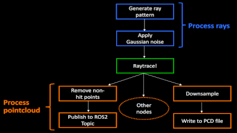

# Robotec GPU Lidar

<h1 align="center">
  
</h1>

## About the project

Robotec GPU Lidar (RGL) is a cross-platform (Windows and Linux) C/C++ library developed by [Robotec.AI](https://robotec.ai/)
for simulating [LiDARs](https://en.wikipedia.org/wiki/Lidar) on CUDA-enabled GPUs, accelerated by RTX cores if available.

One of the use cases of RGL is implementing Lidar sensors in simulation engines.
We are working on integrations with popular game/simulation engines:
- [Unity](https://unity.com/)
- [O3DE](https://www.o3de.org/)
- [Gazebo](https://gazebosim.org/home)


If you would like to have a custom integration, feel free to [contact us](https://robotec.ai/contact/).

## Features

|   |   |
|---|---|
| **Configurable LiDAR pattern and range** | **High performance** |
|  |  |
| **GPU-accelerated point cloud processing** | **Flexible pipeline creation** |
|  |  |

And more:
- Asynchronous raytracing
- Removing non-hit points
- Converting to custom binary output
- Downsampling *
- Writing to PCD file *
- Visualization *
- ROS2 publishing *
- Raw lidar packets publishing via UDP *
- Gaussian noise (see [documentation](docs/GaussianNoise.md))
- Instance/semantic segmentation
- Intensity based on provided textures
- Simple velocity distortion (only sensor velocity considered)

\* [extension](README.md#extensions) required.

## Runtime requirements

|Hardware|Requirement|
|:--|:--|
|GPU|CUDA-enabled|

|Software|Requirement|
|:--|:--|
|Nvidia Driver (Linux)|>=515.43.04|
|Nvidia Driver (Windows)|>=472.50|

## Usage

An introduction to the RGL API along with an example can be found [here](docs/Usage.md).

## Extensions

`RobotecGPULidar` library can be built with extensions enhancing RGL with additional functions:
- `PCL` - adds nodes and functions for point cloud processing that uses [Point Cloud Library](https://pointclouds.org/). See [documentation](docs/PclExtension.md).
- `ROS2` - adds a node to publish point cloud messages to [ROS2](https://www.ros.org/). Check [ROS2 extension doc](docs/Ros2Extension.md) for more information, build instructions, and usage.
- `UDP` - adds a node to publish raw lidar packets, as emitted by physical lidar. Only available in the closed-source version.

## Building in Docker (Linux)

1. Download [NVidia OptiX](https://developer.nvidia.com/designworks/optix/downloads/legacy) **7.2**
2. `export OptiX_INSTALL_DIR=<Path to OptiX>`
3. `docker build --build-context optix=${OptiX_INSTALL_DIR} --target=exporter --output=build .`
    - The binaries will be exported to the `build` directory
4. To build RGL with extensions, docker must install additional dependencies.
    - It could be enabled by setting the following arguments:
        - `--build-arg WITH_PCL=1` - adds stage to install dependencies for PCL extension
        - `--build-arg WITH_ROS2=1` - adds stage to install dependencies for ROS2 extension
    - By default, the build command compiles the core part of the library only. To include extensions it must be overwritten:
        - `--build-arg BUILD_CMD="./setup.py --with-pcl"` - includes PCL extension
        - `--build-arg BUILD_CMD='. /opt/ros/$ROS_DISTRO/setup.sh && ./setup.py ./setup.py --with-ros2'` - includes ROS2 extension (ROS2 must be sourced first)
   - The command for building RGL with PCL and ROS2 extensions would be:

```shell
docker build \
   --build-arg WITH_ROS2=1 \
   --build-arg WITH_PCL=1 \
   --build-arg BUILD_CMD='\
      . /opt/ros/$ROS_DISTRO/setup.sh && \
      ./setup.py \
         --with-ros2 \
         --with-pcl' \
   --build-context optix=$OptiX_INSTALL_DIR \
   --target=exporter \
   --output=build .
```

## Building on Ubuntu 22

1. Install [CUDA Toolkit](https://developer.nvidia.com/cuda-downloads) **11.7+**.
2. Download [NVidia OptiX](https://developer.nvidia.com/designworks/optix/downloads/legacy) **7.2**.
    1. You may be asked to create a Nvidia account to download
3. Export environment variable:
   1. `export OptiX_INSTALL_DIR=<your-OptiX-path>`.
4. Install dependencies with command: `./setup.py --install-deps`
5. Use `setup.py` script to build.
   - It will use CMake to generate files for the build system (make) and the build.
   - You can pass optional CMake and make parameters, e.g.
     - `./setup.py --cmake="-DCMAKE_BUILD_TYPE=Debug" --make="-j 16"`
   - You can build with extensions, e.g.
      - `./setup.py --with-pcl --with-ros2`
   - See `./setup.py --help` for usage information.

## Building on Windows

1. Install [Microsoft Visual Studio](https://visualstudio.microsoft.com/pl/downloads/) (Visual Studio 2019 when using ROS2 extension) with **C++ CMake tools for Windows** component.
2. Install [CUDA Toolkit](https://developer.nvidia.com/cuda-downloads) **11.4.4+**.
3. Download [NVidia OptiX](https://developer.nvidia.com/designworks/optix/downloads/legacy) **7.2**.
   - install the framework and set the environment variable `OptiX_INSTALL_DIR`
4. Install [Python3](https://www.python.org/downloads/).
5. Run `x64 Native Tools Command Prompt for VS 20xx` and navigate to the RGL repository.
6. Run `python setup.py --install-deps` command to install dependencies.
7. Run `python setup.py` command to build the project.
   - It will use CMake to generate files for the build system (ninja) and build.
   - You can pass optional CMake and ninja parameters, e.g.
     - `python setup.py --cmake="-DCMAKE_BUILD_TYPE=Debug" --ninja="-j 16"`
   - You can build with extensions, e.g.
      - `./setup.py --with-pcl --with-ros2`
   - See `python setup.py --help` for usage information.

## Acknowledgements

The development of this project was made possible thanks to cooperation with Tier IV - challenging needs
in terms of features and performance of Tier IV's project allowed to significantly enrich Robotec GPU Lidar
with features such as Gaussian noise and animated meshes as well as optimize it to provide real-time performance with many lidars.
