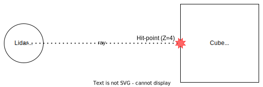

## Usage

RGL was designed to be easy to use from any programming language, therefore it exposes a low-level C API.

The C API is built around several concepts that are introduced in the following chapter.

## API concepts

### Scene

Scene represents 'a place' where the raytracing occurs.
User is expected to fill a scene with entities before performing ray-tracing.
Internally it is used to build hardware raytracing acceleration structures.
Most of the time, a single scene will be sufficient, therefore RGL automatically instantiates the default scene.
The default scene can be referenced by passing null pointer where scene handle is expected.

Note: using multiple scenes is not yet implemented.

### Entity

Entity represents a 3D object on the scene along with its pose (position and rotation).
Entity is a lightweight object - it contains a reference to a heavier Mesh object and a transformation matrix.
Entity's transform is a 3D affine matrix (therefore 3x4) describing entity's local to scene coordinate frame transform.
When created, entity is bound to a scene. Entity cannot be unbound from a scene or bound to multiple scenes.
To create an Entity it is required to provide a Mesh, which must be created first.
Entities can share the same mesh.

### Mesh

Mesh is a handle to the on-GPU data of a 3D model provided by user.

### Lidar

Lidar represents properties of a Lidar such as:
- laser firing pattern
- range (may depend on angle)
- its pose in the scene

Internally it is also associated with a number of GPU resources, which makes its creation/destruction cost significant.
Operations involving different Lidars are done in parallel on the GPU.

## General approach

Usually, using the library will consist of the following steps:

1. Create Meshes (e.g. use an external tool to read them from a file)
2. Create Entities on the scene
3. Create one or more Lidars
4. Set Entities' poses
5. Set Lidars' poses + configure other properties (e.g. range)
6. Schedule raycasting.
7. Get results

RGL is optimized to be used in ever-changing scenes, therefore it is possible to repeat steps 4-7 dozens of times per second (may vary depending on the number of entites and total number of rays).

## Minimal example

The minimal example below demonstrates ray-tracing of a single ray on a scene consisting of a single cube.
Full source code can be found [here](test/src/api_example.cpp)



```c
// Create a mesh
rgl_mesh_t cube_mesh = 0;
RGL_CHECK(rgl_mesh_create(/*arguments omitted for brevity*/));

// Put an entity on the default scene
rgl_entity_t cube_entity = 0;
RGL_CHECK(rgl_entity_create(&cube_entity, NULL, cube_mesh));

// Set position of the cube entity to (0, 0, 5)
rgl_mat3x4f entity_tf = {
    .value = {
        {1, 0, 0, 0},
        {0, 1, 0, 0},
        {0, 0, 1, 5}
    }
};
RGL_CHECK(rgl_entity_set_pose(cube_entity, &entity_tf));

// Create a description of lidar that sends 1 ray
// By default, lidar will have infinite ray range
// and will be placed in (0, 0, 0), facing positive Z
rgl_lidar_t lidar = 0;
rgl_mat3x4f ray_tf = {
    .value = {
        {1, 0, 0, 0},
        {0, 1, 0, 0},
        {0, 0, 1, 0},
    }
};
RGL_CHECK(rgl_lidar_create(&lidar, &ray_tf, 1));

// Start raytracing on the default scene
RGL_CHECK(rgl_lidar_raytrace_async(NULL, lidar));

// Wait for raytracing (if needed) and collect results
int hitpointCount = 0;
rgl_vec3f results[1] = {0};
RGL_CHECK(rgl_lidar_get_output_size(lidar, &hitpointCount));
RGL_CHECK(rgl_lidar_get_output_data(lidar, RGL_FORMAT_XYZ, results));

printf("Got %d hitpoint(s)\n", hitpointCount);
for (int i = 0; i < hitpointCount; ++i) {
    printf("- (%.2f, %.2f, %.2f)\n", results[i].value[0], results[i].value[1], results[i].value[2]);
}
```

### API documentation

More details can be found [here](include/rgl/api/experimental).

### API stability

Currently, the API is experimental - no ground-breaking changes are planned, however minor breaking changes may occur.
API stabilization is planned for the second half of 2022.
