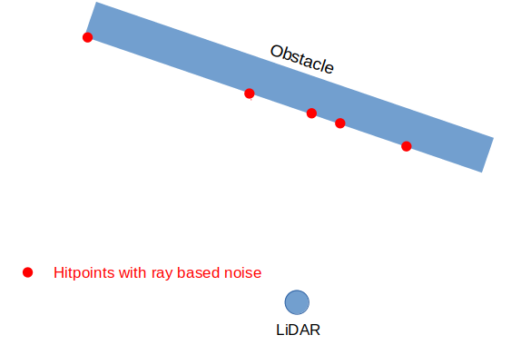

# Gaussian noise

Robotec GPU Lidar (RGL) allows the introduction of Gaussian noise, which models the naturally present noise of the physical devices.

The following formula describes Gaussian noise:

It is parametrized by these two values:
- μ - mean value
- σ - standard deviation

## Supported noise types
    
The following table presents all kinds of Gaussian noise available in RGL concisely.
The subsequent chapters describe them in greater detail.

| Noise type | Visualization |
|------------|---------------|
| **Ray-based angular noise:** <li> Rotate rays around the selected axis of the lidar   <li> This kind of noise intends to model the noise in the lidar's rotational speed |  |
| **Hitpoint-based angular noise**   <li> Rotate hitpoints around the selected axis of the lidar   <li> This is different from rotating rays! Think of the effect on hitpoints on surfaces near-parallel to the ray   <li> This kind of noise could model, e.g., an error in the reading position of the rotated laser or sensor |  |
| **Distance noise**   <li> This kind of noise can model, e.g., an error in measuring the time-of-flight |  |

## Ray-based angular noise

This type of noise applies angular noise to the rays **before raycasting**.
When this type of noise is applied, points stay on the obstacle surface

| Step | Visualization |
|--------------------------|---------------------------------------------|
|Rays are provided by the user via RGL API| |
|Angular noise is applied to rays | |
|Raytracing is performed using noised rays. Hitpoints are produced | |
|Hitpoints with ray-based noise are sent for further processing| |

### Usage

Create `GaussianNoiseAngularRaysNode` using API call `rgl_node_gaussian_noise_angular_ray`. Next, add this node to the RGL pipeline before `RaytraceNode`.

| Parameter name | Type | Description |
|----------------|------|-------------|
| `mean` | `float` | Angular noise mean in radians |
| `st_dev` | `float` | Angular noise standard deviation in radians |
| `axis` | `rgl_axis_t` | Axis on which angular noise will be performed |

## Hitpoint-based angular noise

This type of noise adds angular noise to already computed hitpoints.
In other words, it is a rotation of each hitpoint around LiDAR's origin.
When this type of noise is applied, points may no longer be on the obstacle surface

| Step | Visualization |
|--------------------------|---------------------------------------------|
|Rays are provided by the user via RGL API| |
|Raycasting is performed using user-provided rays. Hitpoints are produced | |
|Hitpoints are rotated by the noise value| |
|Hitpoints with hitpoint-based noise are sent for further processing| |

### Usage

Create `GaussianNoiseAngularHitpointNode` using API call `rgl_node_gaussian_noise_angular_hitpoint`. Next, add this node to the RGL pipeline right after `RaytraceNode`.

| Parameter name | Type | Description |
|----------------|------|-------------|
| `mean` | `float` | Angular noise mean in radians |
| `st_dev` | `float` | Angular noise standard deviation in radians |
| `axis` | `rgl_axis_t` | Axis on which angular noise will be performed |

## Distance noise

This noise changes the distance between the hitpoint and the lidar's origin.

Standard deviation can depend (increase linearly) on the point's distance from the sensor origin.

The overall standard deviation of the distance error is computed as follows:

where

|symbol| description|
|------|------------|
|| computed distance standard deviation applied to hitpoints |
|| base value of distance standard deviation (configurable) |
|| current points distance from sensor origin |
|| rise of the standard deviation per 1 meter of distance (configurable) |

| Step | Visualization |
|--------------------------|---------------------------------------------|
|Rays are provided by the user via RGL API| |
|Raycasting is performed. Hitpoints are produced | |
|Hitpoints distance is changed by noise value| |
|Hitpoints with distance noise are sent for further processing| |

### Usage

Create `GaussianNoiseDistanceNode` using API call `rgl_node_gaussian_noise_distance`. Next, add this node to the RGL pipeline right after `RaytraceNode`.

| Parameter name | Type | Description |
|----------------|------|-------------|
| `mean` | `float` | Distance noise mean in meters |
| `st_dev_base` | `float` | Distance noise standard deviation base in meters. Represented as  in the [Distance noise](#distance-noise) chapter |
| `st_dev_rise_per_meter` | `float` | Distance noise standard deviation rise per meter. Represented as  in the [Distance noise](#distance-noise) chapter |
