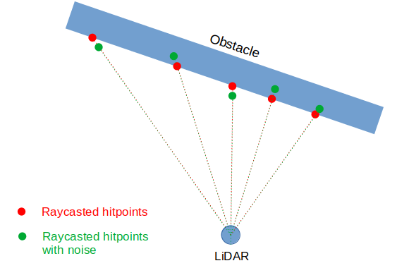

# Gaussian noise

Robotec GPU Lidar (RGL) allows introducing Gaussian noise which models the naturally present noise of the physical devices.

Gaussian noise is described by the following formula:

It is parametrized by these two values:
- μ - mean value
- σ - standard deviation

## Supported noise types
    
The following table presents concisely all kinds of Gaussian noise available in RGL.
The next chapters describe them in greater detail.

| Noise type | Visualization |
|------------|---------------|
| **Ray-based angular noise:** <li> Rotate rays around Y-axis of the lidar   <li> This kind of noise intends to model the noise in lidar's rotational speed |  |
| **Hitpoint-based angular noise**   <li> Rotate hitpoints around Y-axis of the lidar   <li> This is different than rotating rays! Think of the effect on hitpoints on surfaces near-parallel to the ray   <li> This kind of noise could model e.g. error in reading position of the rotated laser or sensor |  |
| **Distance noise**   <li> This kind of noise can model e.g. error in measuring time-of-flight |  |

### Current limitation
Although ray-based and hitpoint based angular noise may occur independently in the real world,
the current implementation treats them as mutually exclusive - only one can be active at a time.
This limitation may be removed in the future.

# Noise configuration API

Noise parameters can be configured using `rgl_lidar_set_gaussian_noise_params` API call.

| Parameter name                         | Type                       | Description                                                                                                                                     |
|----------------------------------------|----------------------------|-------------------------------------------------------------------------------------------------------------------------------------------------|
| `angular_noise_type`                   | `rgl_angular_noise_type_t` | Angular noise type selection enum. More details below                                                                                           |
| `angular_noise_stddev`                 | `float`                    | Angular noise standard deviation in radians                                                                                                     |
| `angular_noise_mean`                   | `float`                    | Angular noise mean in radians                                                                                                                   |
| `distance_noise_stddev_base`           | `float`                    | Distance noise base in meters. Represented as  in [Distance noise](#distance-noise) chapter   |
| `distance_noise_stddev_rise_per_meter` | `float`                    | Distance noise base in meters. Represented as  in [Distance noise](#distance-noise) chapter |
| `distance_noise_mean`                  | `float`                    | Distance noise mean in meters                                                                                                                   |

### `rgl_angular_noise_type_t` possible values

| Field name                   | Value               | Description                                                                                                                        |
|------------------------------|---------------------|-------------                                                                                                                       |
| RAY_BASED                    | `0`                 | Ray-based angular noise. For more information check the [Ray-based angular noise](#ray-based-angular-noise) chapter                |
| HITPOINT_BASED               | `1`                 | Hitpoint-based angular noise. For more information check the [Hitpoint based angular noise](#hitpoint-based-angular-noise) chapter |

## Ray-based angular noise

This type of noise applies angular noise to the rays **before raycasting**.
When this type of noise is applied, points stay on the obstacle surface

| Step | Visualization |
|--------------------------|---------------------------------------------|
|Rays are provided by the user via RGL API| |
|Angular noise is applied to rays | |
|Raytracing is performed using noised rays. Hitpoints are produced | |
|Hitpoints with ray-based noise are sent for further processing| |

## Hitpoint-based angular noise

This type of noise adds angular noise to already computed hitpoints.
In other words, it is a rotation of each hitpoint around LiDAR's origin.
When this type of noise is applied, points may be no longer on the obstacle surface

| Step | Visualization |
|--------------------------|---------------------------------------------|
|Rays are provided by the user via RGL API| |
|Raycasting is performed using user-provided rays. Hitpoints are produced | |
|Hitpoints are rotated by the noise value| |
|Hitpoints with hitpoint-based noise are sent for further processing| |

## Distance noise

This kind of noise changes the distance between hitpoint and lidar's origin.

Standard deviation can depend (increase linearly) on the point's distance from the sensor origin.

Overall standard deviation of the distance error is computed as follows:

where

|symbol| description|
|------|------------|
|| computed distance standard deviation applied to hitpoints |
|| base value of distance standard deviation (configurable) |
|| current points distance from sensor origin |
|| rise of the standard deviation per 1 meter of distance (configurable) |

| Step | Visualization |
|--------------------------|---------------------------------------------|
|Ray are provided by the user via RGL API| |
|Raycasting is performed. Hitpoints are produced | |
|Hitpoints distance is changed by noise value| |
|Hitpoints with distance noise are sent for further processing| |

## Details of the Gaussian noise in RGL pipeline

Noise application steps are marked in **bold**. All of them are optional.

1. Ray poses are provided by the user
1. **Angular noise is added to the rays**
1. Nvidia OptiX uses noised ray poses to perform raycasting operations
1. Two point clouds are produced (note: subject to change in the future)
    - one in the world coordinate system - for visualization
    - second in the LiDARs local coordinate system - actual data
1. **Angular noise is applied to both point clouds**
1. **Distance noise is applied to both point clouds**
1. Non-hit points are removed from the point clouds (in the future, this will be done before applying hitpoint based noise)
1. Point cloud data is converted to the final binary format to be sent via ROS topics

