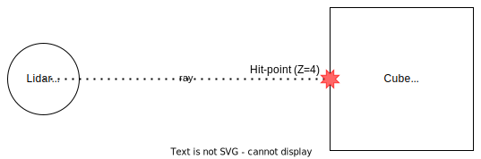

## Usage

RGL was designed to be easy to use from any programming language. Therefore it exposes a low-level C API.

The C API is built around several concepts introduced in the following chapter.

## API concepts

### Mesh

Mesh is a handle for the on-GPU data of a 3D model provided by user. Texture coordinates are optional and can be omitted. However, they are necessary for intensity calculation.

### Entity

An Entity represents a 3D object on the Scene and its pose (position and rotation).
It is a lightweight object containing a reference to a heavier Mesh object and a transformation matrix.
The Entity's transform is a 3D affine matrix (therefore 3x4) describing the Entity's local-to-Scene coordinate frame transform.
The coordinate system in RGL is right-handed: the positive x and y axes point right and up, and the negative z-axis points forward. Positive rotation is counterclockwise about the axis of rotation.
When created, the Entity is bound to a Scene. The Entity cannot be unbound from a Scene or bound to multiple Scenes.
In order to create an Entity, it is required to provide a Mesh, which must be created first.
Entities can share the same Mesh.

### Texture
A Texture is a handle for the on-GPU data of a 2D image provided by the user. It is used to calculate the intensity of a hit point. It is expected to be a grayscale image in 8-bit red channel data. The intensity is calculated by sampling the Texture at the Mesh's Texture coordinates. If the Texture coordinates are not present, the Texture will not be sampled.
 
The Texture coordinates are calculated by interpolating the Texture coordinates of the hitpoint's triangle vertices. The Texture coordinates of the triangle vertices are provided by the user when creating the Mesh and should be assigned via API call. The Texture coordinates are expected to be in the range [0, 1]. If the range is exceeded, then the Texture will be tiled. 

The Texture is optional and can be omitted. If the Texture is omitted, the intensity is set to 0.0. 

The Texture is assigned to the Entity. Entities can share the same Texture.

### Scene

The Scene represents 'a place' where the raytracing occurs.
The user is expected to fill the Scene with entities before performing raytracing.
Internally it is used to build hardware raytracing acceleration structures.
Most of the time, a single Scene will be sufficient. Therefore RGL automatically instantiates the default Scene.
The default Scene can be referenced by passing a null pointer where the Scene handle is expected.

Note: Using multiple Scenes still needs to be implemented.

### Node

A Node performs a single operation, for example:
 - set rays for raytracing from transforms 
 - transform rays
 - set the desired output format 
 - compact result (remove non-hits)
 - downsample result (merge points that are very close to each other)
 - perform raytracing

It has to be connected to other Nodes in order to function correctly.
If the Node is active, it is executed while running the Graph.
Nodes are active by default but can be deactivated.
Children of deactivated Nodes are also not executed while running the Graph.

### Graph

Connected Nodes create a Graph. The Graph can be run to calculate the result for each Node.
Using the Graph concept the end user can easily tailor the functionality and output format to their needs by adding/removing specific Nodes.
The typical use case is simulating a Lidar.

## General approach

Usually, using the library consists of the following steps:

1. Create Meshes (e.g., use an external tool to read them from a file)
2. Create Entities on the Scene
3. Create Nodes
4. Connect Nodes into Graph(s)
5. Set Entities' poses
6. Run Graph(s)

RGL is optimized to be used in ever-changing Scenes. Therefore it is possible to repeat steps 5 and 6 dozens of times per second (may vary depending on the number of Entities, rays, and Nodes).

## Minimal example

The minimal example below demonstrates raytracing of a single ray on a Scene consisting of a single cube.
The full source code can be found [here](../test/src/apiReadmeExample.cpp)



```c
// Create a Mesh
rgl_mesh_t cube_mesh = nullptr;
rgl_mesh_create(&cube_mesh, /* remaining arguments skipped for the sake of brevity */);

// Put an Entity on the default Scene
rgl_entity_t cube_entity = nullptr;
rgl_entity_create(&cube_entity, nullptr, cube_mesh);
// Set the position of the cube Entity to (0, 0, 5)
rgl_mat3x4f entity_tf = {
.value = {
    { 1, 0, 0, 0 },
    { 0, 1, 0, 0 },
    { 0, 0, 1, 5 }}
};
rgl_entity_set_transform(cube_entity, &entity_tf);

// Create a Graph representation of a lidar that sends 1 ray and is situated at (x,y,z) = (0, 0, 0), facing positive Z
rgl_mat3x4f ray_tf = {
.value = {
    { 1, 0, 0, 0 },
    { 0, 1, 0, 0 },
    { 0, 0, 1, 0 }}
};

rgl_node_t useRays = nullptr, raytrace = nullptr;

rgl_node_rays_from_mat3x4f(&useRays, &ray_tf, 1);
rgl_node_raytrace(&raytrace, nullptr);
rgl_graph_node_add_child(useRays, raytrace);

// You can run the Graph using any one of its Nodes
rgl_graph_run(raytrace);

// Wait for the Graph to run (if needed) and collect results
int32_t hitpoint_count;
int32_t point_size;
rgl_vec3f results[1];
rgl_graph_get_result_size(raytrace, RGL_FIELD_XYZ_VEC3_F32, &hitpoint_count, &point_size);
rgl_graph_get_result_data(raytrace, RGL_FIELD_XYZ_VEC3_F32, &results);

printf("Got %d hitpoint(s)\n", hitpoint_count);
for (int i = 0; i < hitpoint_count; ++i) {
printf("- (%.2f, %.2f, %.2f)\n", results[i].value[0], results[i].value[1], results[i].value[2]);
}
```

### API documentation

More details can be found [here](../include/rgl/api/core.h).
