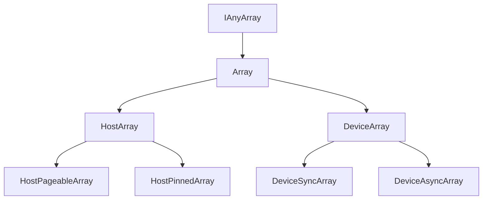

## Purpose

This document describes classes related to memory management.

## Inheritance graph of Array classes

## FAQ:

- Why there are so many Array classes?
    - This stems from two problems that need to be solved in RGL.
        - First, we need to operate on different kinds of memory (defined in MemoryKinds).
          There are subtle but important differences between them (which are well described in CUDA programming guide).
        - Second, we allow point clouds to contain an arbitrary (defined at runtime) set of attributes.
          To make it possible to store point cloud in a simple container, we need arrays that are typed in runtime (
          IAnyArray).

- Why Arrays can be instantiated and accessed only through shared_ptr?
    - To reduce hair loss:
        - Mixing polymorphism and stack objects is risky (e.g., object slicing);
        - Operating on references (e.g. when doing dynamic_casts) invites lifetime bugs, slowing down development speed.
        - Using shared_ptrs remove the need for {copy,move} {ctor,operator=} which are not welcomed here anyway.
    - We consciously pay the price of shared_ptr (indirect access, atomic operations). If the performance is proven
      to bottleneck due to the usage of shared_ptr (which is unlikely), we will reconsider removing shared_ptrs.

- Memory operations could be implemented using pure virtual functions in Array and overriding them in subclasses. Why
  not?
    - Virtual destructor of Array needs to call deallocate, which may refer to already destroyed members of subclass (
      e.g. stream).

- Why do all classes have non-typename template parameter MemoryKind?
  - We really want to know the memory kind (and thus - location) of an array at compile time to write performance-aware code.
